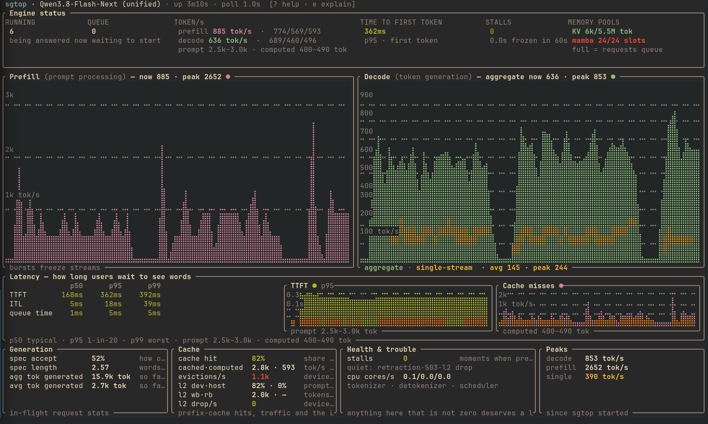
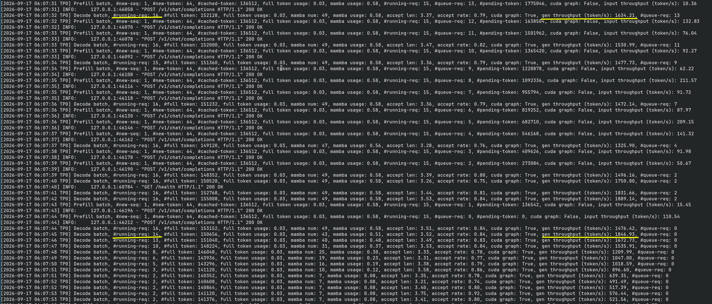

# sglang-qwen38fn-sm120-turbo

Serving stack for **Qwen3.8-Flash-Next** on 96 GiB VRAM (1x RTX Pro 6000) or 192 GiB VRAM (2x RTX Pro 6000):
- https://qwen.ai/blog?id=qwen3.8-flash-next
- https://huggingface.co/Qwen/Qwen3.8-Flash-Next
- https://github.com/QwenLM/Qwen3.8-Flash-Next/blob/main/tech_report.pdf

Qwen3.8-Flash-Next is a highly performant LLM that serves as a preview for the future Qwen4 family.
Despite being undertrained, and having very few active parameters and a small size (125B + 6B active + 51B of offloadable embedding table), benchmarks show performance comparable to closed-source LLMs from just 3 months ago (e.g. Opus 4.8).

> [!IMPORTANT]
> **What's new since r22.**
>
> **r23 — NVIDIA release.** Support for the ModelOpt checkpoint
> `nvidia/Qwen3.8-Flash-Next-NVFP4`, served by
> `serve_sglang_qwen3.8-flash-next-nvidia-tp1-example.sh`.
>
> **r24 — TP=2 + High quality QAD (Quantization-Aware Distillation from local-inference-lab)**
> QAD uses the BF16 model to recalibrate the NVFP4 model and recover quantization losses after multi-days recalibration on 16x RTX Pro 6000. Furthermore we now support the W4A16_NVFP4 format which unlike bae NVFP4, keeps activations in 16-bit so activation spikes are properly carried over to consuming layers without distorting scale or being clamped.

> [!TIP]
> *Monitor your server with [`sgtop`](https://github.com/mratsim/sgtop), my sglang dedicated monitoring tool.*
>
> 

## Numbers

On the NVFP4 checkpoint [`RadixArk/Qwen3.8-Flash-Next-NVFP4`](https://huggingface.co/RadixArk/Qwen3.8-Flash-Next-NVFP4), served by the day-0 SGLang image at TP=1:
- 1x RTX Pro 6000, power-limited to 360W, memory overclocked by +3000MT/s (+6000 in LACT)
- 939456 tokens in KV cache for 4 max concurrent requests @ 0.98 GPU memory utilization
- 856256 tokens in KV cache for 8 max concurrent requests @ 0.98 GPU memory utilization
- 11k~13k prefill tok/s

  <details><summary>prefill trace</summary>

  

  </details>
- Aggregate 800 decode tok/s (~200 tok/s per stream) on hard-to-predict `--profile estonia` reasoning benchmark from https://github.com/local-inference-lab/llm-inference-bench

  <details><summary>decode trace, 4 concurrent requests</summary>

  

  </details>
- Aggregate 1170 decode tok/s aggregate at 8 concurrent requests

  <details><summary>decode trace, 8 concurrent requests</summary>

  

  </details>
- up to 355 decode tok/s single request on easy to predict code/compaction. `--profile lavd`  reasoning benchmark from https://github.com/local-inference-lab/llm-inference-bench

  <details><summary>decode trace, single request</summary>

  

  </details>
- 206~234 tok/s single request on hard to predict concurrency benchmark from https://github.com/local-inference-lab/llm-inference-bench


On the local-inference-lab QAD checkpoint
[`local-inference-lab/Qwen3.8-Flash-Next-NVFP4`](https://huggingface.co/local-inference-lab/Qwen3.8-Flash-Next-NVFP4),
served by `serve_sglang_qwen3.8-flash-next-lil-tp2-example.sh` at TP=2 on 2x RTX Pro 6000:
- Aggregate 1600~1800 decode tok/s for 16 max concurrent requests (MTP accept length 3.2~3.5)

  <details><summary>decode trace, 16 concurrent requests</summary>

  

  </details>
- 228 decode tok/s single request on the same hard-to-predict concurrency benchmark

## Behind-the-scenes

This builds on the pinned `lmsysorg/sglang:dev-cu13-qwen38-next-local`
image at SGLang commit `4ccff141dbe992794f9da6c3aa23535b4f72000d` with patches in `patches/` being applied on top.

## Build and serve

Build the shared image from the repository root:

```bash
podman build -t localhost/sglang-qwen38fn-sm120-turbo:r24 .
```

### Support matrix

All three run on an RTX PRO 6000 (SM120). Pick the row that matches your checkpoint.

| Checkpoint | Launcher | Quantization | GPUs | Context | Status |
| --- | --- | --- | --- | --- | --- |
| [RadixArk/Qwen3.8-Flash-Next-NVFP4](https://huggingface.co/RadixArk/Qwen3.8-Flash-Next-NVFP4) | `serve_sglang_qwen3.8-flash-next-radixark-tp1-example.sh` | NVFP4, MXFP8 added at load | 1 | 262144 | benchmarked above |
| [nvidia/Qwen3.8-Flash-Next-NVFP4](https://huggingface.co/nvidia/Qwen3.8-Flash-Next-NVFP4) | `serve_sglang_qwen3.8-flash-next-nvidia-tp1-example.sh` | mixed, MXFP8 added at load | 1 | 262144 | measured below |
| [local-inference-lab/Qwen3.8-Flash-Next-NVFP4](https://huggingface.co/local-inference-lab/Qwen3.8-Flash-Next-NVFP4) | `serve_sglang_qwen3.8-flash-next-lil-tp2-example.sh` | mixed, prequantized | 2 | 327680 | new in r24 |

All three are ready to run; edit their image tag, cache paths and tuning knobs for your
machine. The third needs a second GPU and more system RAM, and takes `MODEL_SOURCE` and
`MODEL_REVISION` because its checkpoint is a branch rather than the default revision.

### RadixArk checkpoint

The launcher exposes:
- `IMAGE`: tag you built below
- `MODEL_SOURCE`: `hf` (downloads to `HF_CACHE`) or `local` (reads `LOCAL_MODELS/<dir>` offline)
- `GPU_UTIL`, `MAX_RUNNING`, `HICACHE_SIZE`: KV fraction, concurrency, KVcache RAM offloading
- `PODNAME`, `SGLANG_PORT`: container name and port

```bash
./serve_sglang_qwen3.8-flash-next-radixark-tp1-example.sh    # recap of the full config goes to stderr
curl -s localhost:30000/health
```

### NVIDIA checkpoint

[`nvidia/Qwen3.8-Flash-Next-NVFP4`](https://huggingface.co/nvidia/Qwen3.8-Flash-Next-NVFP4)

```bash
./serve_sglang_qwen3.8-flash-next-nvidia-tp1-example.sh
curl -s localhost:8000/health
```

### The local-inference-lab release

The QAD release from
[`local-inference-lab/Qwen3.8-Flash-Next-NVFP4`](https://huggingface.co/local-inference-lab/Qwen3.8-Flash-Next-NVFP4),
the one described in the r24 note above. Its attention layers are prequantized MXFP8, so this launcher runs
with the ONLINE_MXFP8 off.

QAD is a **branch** of that repo, `qad-step-4000`, not its default revision.

For local download
```
hf download local-inference-lab/Qwen3.8-Flash-Next-NVFP4 --revision qad-step-4000 --local-dir …`
```


```bash
./serve_sglang_qwen3.8-flash-next-lil-tp2-example.sh
curl -s localhost:30000/health
```

The example script shows how to run the model on TP=2 with YaRN to 327680 max context.
The model supports up to 1M context with YaRN.

- **Quality:** `qad-step-4000` is the recommended checkpoint of the three. Against the
  published NVFP4 revision it scored 79.4% vs 77.5% on AA-LCR v1.1 over ten generations
  ([AA-LCR report](https://github.com/local-inference-lab/rtx6kpro/blob/e8e23de/models/qwen38-flash-next/aa-lcr-nvfp4-vs-qad.md))
  and 78.69% vs 77.17% on exact arithmetic with reasoning disabled
  ([arithmetic report](https://github.com/local-inference-lab/rtx6kpro/blob/e8e23de/models/qwen38-flash-next/direct-arithmetic-stability-nvfp4-vs-qad.md)).

### Your own variants

Keep your own variants in `internal/`: the folder ships empty and everything in it is git-ignored, so a customized launcher (`internal/serve_my.sh`, host paths, bench settings) lives beside the stack without ever being committed or published.

## Acknowledgements

While I choose different solutions, a significant amount of work has gone into both quant and tuning inference engines.

Thanks to:
- [SGLang](https://github.com/sgl-project/sglang) / [RadixArk](https://huggingface.co/RadixArk) for the day-0 image support ([`lmsysorg/sglang:qwen38flashnext`](https://hub.docker.com/r/lmsysorg/sglang)) and the [NVFP4 quant](https://huggingface.co/RadixArk/Qwen3.8-Flash-Next-NVFP4)
- local-inference-lab ([GitHub](https://github.com/local-inference-lab), [Hugging Face](https://huggingface.co/local-inference-lab), incl. the [NVFP4 release](https://huggingface.co/local-inference-lab/Qwen3.8-Flash-Next-NVFP4) and the [llm-inference-bench](https://github.com/local-inference-lab/llm-inference-bench) the Numbers section measures on), voipmonitor, lukealonso and the community for supporting RTX Pro 6000 development with kernels, docker images, quants and benchmark tooling.
- [kanadaj/sglang](https://github.com/kanadaj/sglang) — the local-inference-lab checkpoint support in this image is ported from their fork: `0020`–`0025` re-anchor their `0004`, `0008`, `0009`, `0010`, `0011` and `0018` onto this base.
- Other serving stacks for Qwen3.8-Flash-Next:
  - [jpezzulli/sglang-rtxpro6000](https://github.com/jpezzulli/sglang-rtxpro6000)
  - [gabrielolympie/sglang-flashnext-sm120](https://github.com/gabrielolympie/sglang-flashnext-sm120)
  - [lovedheart/sglang](https://github.com/lovedheart/sglang) and their [NVFP4-FP8 checkpoint](https://huggingface.co/lovedheart/Qwen3.8-Flash-Next-NVFP4-FP8)
  - [ormandj/sglang-qwen38-flash-next-sm120](https://github.com/ormandj/sglang-qwen38-flash-next-sm120)
  - [yepapa-nest/qwen38-flashnext-rtx6000](https://github.com/yepapa-nest/qwen38-flashnext-rtx6000)

## License

SGLang and the patches are under the Apache-2.0 License.

The SGLang docker image builds on top of NVIDIA's Ubuntu+CUDA image, which is under the NVIDIA Deep Learning Container License.
